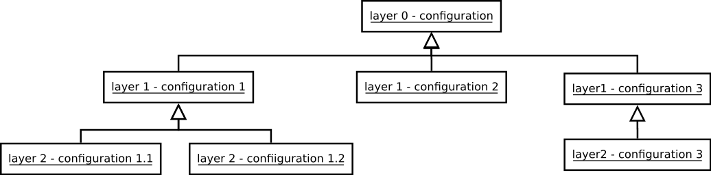
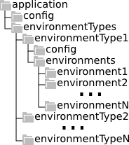

# Maven plugin for configuration management

This plugin makes configuration bundles for an application. So the same
executable code can be configured to run in different environments. See below:

 - [General information](#user-content-general-information)
 - [Goals](#user-content-goals)
 - [Lifecycles](#user-content-lifecycles)


## General information

```xml
<plugin>
    <groupId>com.griddynamics.maven.plugins</groupId>
    <artifactId>cm-maven-plugin</artifactId>
    <version>1.2.0</version>
</plugin>
```

Maven repository for released binaries: https://nexus.griddynamics.net/nexus/content/groups/public


## Goals

Plugin contains one goal described in the following subsection.

 - [cm:merge](#user-content-cmmerge) merges configuration layers, archives
    merged configuration and attaches it to maven project.

### cm:merge

Configuration is assumed to be divided to separate layers. Each layer may
contain configuration for a specific scope (e.g. global application
configuration, environment specific configuration, etc...).

Layered configurations are meanwhile organized in tree structure.



Such tree as follows from graph theory has nodes and leafs. `merge` goal
allows to create configurations in each vertex of the graph.
Directory structure of each configuration layer is merged against higher
levels following tree hierarchy.
Plugin traverses tree from root to leafs. When it meets a file or directory
inside configuration it looks for an appropriate algorithm which will be used
to merge files from configuration vertex with files in target destination.
The responsibility of algorithm is to decide what to do with files and
directories in sources vertex and target directories.

#### Parameters

The following subsections describe parameters which may be used to customize
merge goal behavior.

Name                | Description
--------------------|------------
**buildDir**        | Specifies the directory for output directories and files.<br>Default: `${project.build.directory}`
**configDir**       | Specifies the location of layer-specific configuration.<br>Default: `config`
**type**            | Specifies the type of archive in output.<br>Default: `zip`
**layers**          | Specifies configuration layers.<br>See [below](#user-content-layers) for details.
**treeAlgorithms**  | This is the list of algorithms to use for merging directories. The first algorithm from this list which allows to merge two files will be used.<br>See [below](#user-content-treealgorithms) for details.
**fileAlgorithms**  | This is the list of algorithms to use for merging files. The first algorithm from this list allows which to merge two files will be used.<br>See [below](#user-content-filealgorithms) for details.

#### Parameters Details

##### layers

Each layer has mandatory attribute name. This attribute also is the name
of directory in which next layers configurations are located directory.
The following image illustrates directory structure for first two levels
of default plugin configuration:



Additionally there are two attributes:
 - **includeNode** – wether to build end configuration from this layer
    if there are lower level configurations (i.e. this configuration on
    a layer is actually a node in configuration tree).  
    This is defaulted to `false`.
 - **includeLeaf** – wether to build end configuration from this layer
    if there are no lower level configurations (i.e. this configuration
    on a layer is actually a leaf in configuration tree).  
    This is defaulted to `true`.  
    Note: if configuration no leafs were created for a configuration node,
    then node becomes a leaf.

Default:
```xml
<layers>
    <layer>
        <name>application</name>
        <includeNode>false</includeNode>
        <includeLeaf>true</includeLeaf>
    </layer>
    <layer>
        <name>environmentTypes</name>
        <includeNode>false</includeNode>
        <includeLeaf>true</includeLeaf>
    </layer>
    <layer>
        <name>environment</name>
        <includeNode>false</includeNode>
        <includeLeaf>true</includeLeaf>
    </layer>
    <layer>
        <name>instances</name>
        <includeNode>false</includeNode>
        <includeLeaf>true</includeLeaf>
    </layer>
</layers>
```

##### treeAlgorithms

This is the list of algorithms to use for merging directories. The first
algorithm from this list which allows to merge two files will be used.
Each algorithm may be provided with additional properties which allow
to refine its behavior. E.g. provide exclude list for files which should not
be merged using specific algorithm.

Default:
```xml
<treeAlgorithms>
    <treeAlgorithm>
        <implementation>com.griddynamics.maven.plugin.cm.algorithms.tree.RecursiveTreeMergeAlgorithm</implementation>
        <configuration>
            <includes/>
            <excludes/>
        </configuration>
    </treeAlgorithm>
</treeAlgorithms>
```

##### fileAlgorithms

Each algorithm may be provided with additional properties which allow
to refine its behavior. E.g. provide exclude list for files which should not
be merged using specific algorithm.

Default:
```xml
<fileAlgorithms>
    <fileAlgorithm>
        <implementation>com.griddynamics.maven.plugin.cm.algorithms.file.PropertiesFileMergeAlgorithm</implementation>
        <configuration>
            <includes/>
            <excludes/>
        </configuration>
    </fileAlgorithm>
</fileAlgorithms>
```

#### Merge algorithms

The following sections describe merge algorithms which are included into
plugin. Each algorithm is configurable, i.e. it supports includes and excludes
properties in its configuration.

Includes and excludes are regular expressions separated with path separator
(':' in Linux/Mac and ';' in Windows) which match file name or path from
beginning of configuration tree.

The following rules are applied for filtering:
 - If there are only includes, then only files which were matched will be
    processed by algorithm.
 - If there are only excludes, then all files which were not matched will be
    processed by algorithm.
 - If there are both, then includes will override excludes and all files will
    as from previous point will be processed, additionally with those which
    were included.

##### Tree merge algorithms

###### Recursive tree merge algorithm

Class: `com.griddynamics.maven.plugin.cm.algorithms.tree.RecursiveTreeMergeAlgorithm`

This algorithm allows to merge two directory structures recursively.
The following rules are applied:
 - If there is no directory in destination directory then it is created
 - Merge proceeded with choosing next tree merge algorithm

###### Replace tree merge algorithm

Class: `com.griddynamics.maven.plugin.cm.algorithms.tree.ReplaceTreeMergeAlgorithm`

This algorithm allows to replace tree structure with lower level (more close
to bottom of the tree).
If algorithm meets directory which satisfies configuration it just removes it
from destination and then copies it from source.

##### File merge algorithms

###### Copy file merge algorithm

Class: `com.griddynamics.maven.plugin.cm.algorithms.file.CopyFileMergeAlgorithm`

This merge algorithms is invoked when there is no destination file and source
file exists. It allows to keep file from higher level (closest to tree root).

###### Overwrite file merge algorithm

Class: `com.griddynamics.maven.plugin.cm.algorithms.file.OverwriteFileMergeAlgorithm`

This merge algorithm is invoked when there are both destination and source
files. It overrides destination file with source file allowing to use file
from the lowest level (closest to tree bottom).

###### Properties file merge algorithm

Class: `com.griddynamics.maven.plugin.cm.algorithms.file.PropertiesFileMergeAlgorithm`

This merge algorithm appends properties file to destination overriding
all properties in destination with source ones.

###### Join file merge algorithm

Class: `com.griddynamics.maven.plugin.cm.algorithms.file.JoinFileMergeAlgorithm`

This merge algorithm appends one lower level file to top-level one.


## Lifecycles

Plugin has one lifecycle which is described in the following section.

### configuration packaging

This lifecycle allows to simplify plugin configuration. The following usage is
assumed:
```xml
<?xml version="1.0" encoding="UTF-8"?>
<project xmlns="http://maven.apache.org/POM/4.0.0"
        xmlns:xsi="http://www.w3.org/2001/XMLSchema-instance"
        xsi:schemaLocation="http://maven.apache.org/POM/4.0.0 http://maven.apache.org/xsd/maven-4.0.0.xsd">
    <modelVersion>4.0.0</modelVersion>
    <groupId>test</groupId>
    <artifactId>configuration-merge-test-project</artifactId>
    <version>1.0.0-SNAPSHOT</version>
    <packaging>configuration</packaging>
    ...
    <build>
        ...
        <plugins>
            ...
            <plugin>
                <groupId>com.griddynamics.maven.plugins</groupId>
                <artifactId>cm-maven-plugin</artifactId>
                <version>1.0.0-SNAPSHOT</version>
                <extensions>true</extensions>
                <configuration>
                    ...
                </configuration>
            </plugin>
            ...
        </plugins>
        ...
    </build>
    ...
</project>
```

Note: Don't forget to set `<extensions>true</extensions>` for plugin.
Otherwise custom lifecycles will not work.


## Copyright and License

Copyright 2014 [Grid Dynamics International, Inc.](http://www.griddynamics.com)

Licensed under the [Apache License, Version 2.0](LICENSE) (the "License");  
you may not use this file except in compliance with the License.  
You may obtain a copy of the License at

    http://www.apache.org/licenses/LICENSE-2.0

Unless required by applicable law or agreed to in writing, software
distributed under the License is distributed on an "AS IS" BASIS,
WITHOUT WARRANTIES OR CONDITIONS OF ANY KIND, either express or implied.
See the License for the specific language governing permissions and
limitations under the License.
